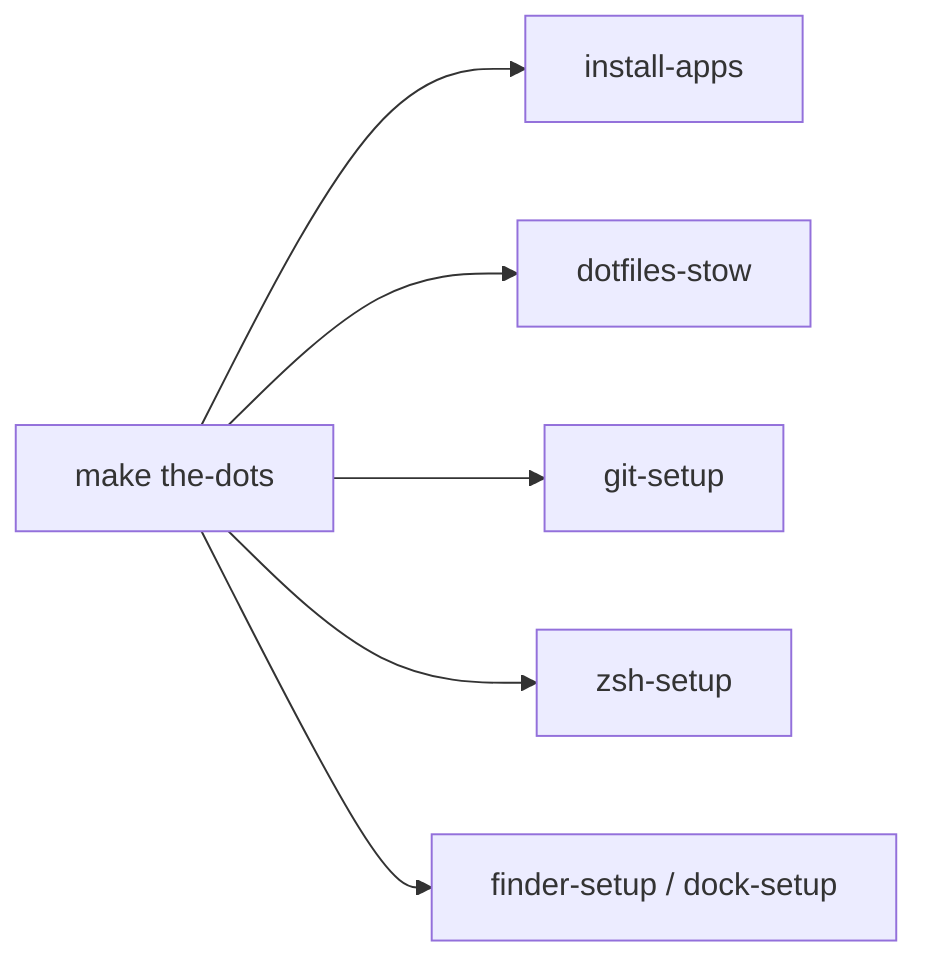

# the-dots

Personal macOS development environment managed with [GNU Stow](https://www.gnu.org/software/stow/) and a [`gum`](https://github.com/charmbracelet/gum)-powered TUI wizard.

## Why it exists

Keep one machine's shell config, Git identity, Homebrew apps, and macOS settings reproducible and easy to re-apply after a fresh install — without needing to remember the correct order or command for each piece.

## Status

Stable for daily use. Covers: `zsh`, `git`, Homebrew bundles, Finder, Dock, and an interactive wizard that wraps all Make targets.

## How to start

```sh
git clone https://github.com/thepanadev/the-dots.git ~/the-dots
cd ~/the-dots
make the-dots   # interactive wizard — installs gum if needed
```

The wizard reads targets directly from the Makefile and presents a menu. Every option is also runnable standalone via `make <target>`.

To preview the docs locally:

```sh
# Install mkdocs once (uv recommended)
uv tool install mkdocs --with mkdocs-material --with pymdown-extensions

./scripts/docs/generate-all.sh
mkdocs serve
```

## Where to go next

- [Reference](reference/index.md) — full Make target listing and script inventory


